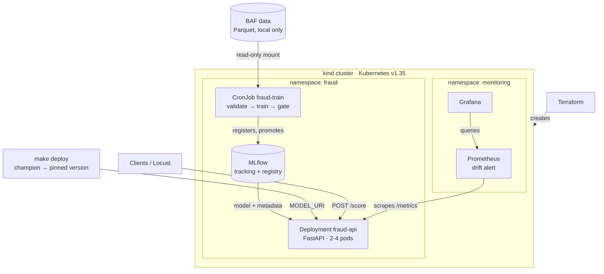

# fraud-mlops

[](https://github.com/eduardooliveiraps/fraud-mlops/actions/workflows/ci.yml)

A fraud scoring service with a reproducible **train → gate → deploy → monitor** loop on Kubernetes.
A LightGBM model scores bank account applications from the Bank Account Fraud dataset
(NeurIPS 2022). The whole platform runs on a laptop with free, open-source tools, and CI rebuilds
and tests it from scratch on every push.

**Contents:** [Highlights](#highlights) · [Tech stack](#tech-stack) · [How it works](#how-it-works) ·
[Architecture](#architecture) · [Results](#results) · [Key design decisions](#key-design-decisions) ·
[Getting started](#getting-started) · [Production considerations](#production-considerations) ·
[Repository layout](#repository-layout) · [Dataset and license](#dataset-and-license)

## Highlights

- **Automated, gated retraining**: a Kubernetes CronJob validates the data, trains, registers the
  model in MLflow, and promotes it only if it beats the current champion on the same held-out data.
- **Production-style serving**: pinned model versions, health probes, autoscaling (2→4 pods), and
  **zero failed requests** during a model rollout and rollback under load.
- **Drift monitoring**: Prometheus and Grafana, with an alert that fires when the score
  distribution shifts, demonstrated end to end.
- **CI/CD on a real cluster**: every push builds the image, creates a throwaway Kubernetes
  cluster, trains, deploys and calls the live API, then publishes the tested image.
- **Infrastructure as code**: Terraform creates the cluster and installs the add-ons.
- **Reproducible and pinned**: locked dependencies with a 14-day cool-down, tools and images pinned
  by checksum or digest, and every model version tagged with its data hash and image.

## Tech stack

| Area | Tools |
|------|-------|
| Model | Python 3.11, LightGBM, scikit-learn, pandas, Pandera |
| ML lifecycle | MLflow 3 (tracking, model registry, aliases) |
| Serving | FastAPI, uvicorn, Prometheus client |
| Platform | Kubernetes (kind), Terraform, Helm charts, Docker |
| Observability | Prometheus, Grafana, metrics-server |
| Delivery and testing | GitHub Actions, GHCR, pytest, Locust, ruff |

## How it works

1. **Train.** A weekly CronJob runs the training image in the cluster. It validates the data
   (strict schema), trains on months 0-4, picks a cost-based decision threshold on month 5 and
   evaluates on months 6-7. The model is registered in MLflow with its threshold, feature list
   and a reference score histogram for drift monitoring.
2. **Gate.** The new version and the current `champion` are both re-scored on the same test
   months. The `champion` alias moves only if recall at 5% FPR improves by at least 0.005 and
   PR-AUC drops by no more than 0.005. Every version is tagged with the decision and the reason.
3. **Deploy.** `make deploy` resolves `champion` to a fixed version number and rolls it out to the
   API. Because every deploy pins a version, `make rollback` restores the previous model.
   Rollouts replace pods one at a time and never remove a ready pod first.
4. **Monitor.** Each API pod exposes request, latency and score metrics, plus PSI (Population
   Stability Index) comparing recent scores with the training reference. Prometheus scrapes all
   pods automatically; the `FraudScoreDrift` alert fires when PSI stays above 0.2 for 5 minutes.
   The response is to check the input data and retrain, back to step 1.

**CI/CD.** On every push and pull request, GitHub Actions runs lint and unit tests, then the whole
loop on a fresh cluster with synthetic data (the licensed dataset never reaches CI). On `main`,
the image that passed is pushed to `ghcr.io/eduardooliveiraps/fraud-mlops:<commit>`.

## Architecture



| Component | Code | Notes |
|-----------|------|-------|
| Training and gate | `src/fraud/train.py`, `src/fraud/gate.py`, `k8s/train/` | Same code runs on the laptop (`make train`) and in the cluster. |
| Model registry | `k8s/mlflow/` | MLflow on SQLite; data on a host mount, so it survives cluster rebuilds. |
| Scoring API | `src/fraud/serve.py`, `k8s/api/` | `POST /score`, `GET /health`, `GET /metrics`; same image as training. |
| Monitoring | `k8s/prometheus/`, `k8s/grafana/` | Alert rule and dashboard live in the repo. |
| Platform | `terraform/` | kind cluster plus metrics-server, Prometheus and Grafana (pinned Helm charts). |
| CI/CD | `.github/workflows/ci.yml` | Lint, tests, cluster smoke test, image push. |

## Results

### Model

Test months 6-7 (205,011 applications, 1.40% fraud):

| Model | Recall at 5% FPR | PR-AUC |
|-------|-----------------:|-------:|
| Random ranking | 0.050 | 0.014 |
| `credit_risk_score` alone | 0.198 | 0.037 |
| **LightGBM** (`fraud-lgbm`, champion) | **0.553** | **0.196** |

At the cost-based threshold (assuming a missed fraud costs 20 times a false alarm), the model
catches 58.7% of frauds while flagging 6.1% of legitimate applications: a cost of 176 per 1,000
applications, against 280 for flagging nothing. Training takes about 47 s and 1.3 GB of RAM.

### Serving

Load test with 50 users (pods limited to 1 CPU; the laptop also runs Locust, MLflow and Docker):

| Scenario | Pods | Throughput | Median latency | Failed requests |
|----------|-----:|-----------:|---------------:|----------------:|
| Before autoscaling | 2 | 84 req/s | 325 ms | 0 |
| After autoscaling | 4 | 134 req/s | 160 ms | 0 |
| Rollout to a new model version, then rollback | 4 | 134 req/s | 140 ms | 0 of 31,938 |

The API returns exactly the offline scores (maximum difference 0.0 on 1,000 held-out
applications), so there is no training/serving skew.

### Drift monitoring

`make drift-demo` sends real held-out traffic, then shifted traffic:

| Traffic | PSI | `FraudScoreDrift` alert |
|---------|----:|-------------------------|
| Real held-out applications | 0.007-0.015 | inactive |
| Shifted (synthetic) applications | 0.49-0.62 | pending, then **firing after 5 minutes** |
| Real applications again | 0.018 | resolved |

<details>
<summary>Data facts: volume and fraud rate per month</summary>

Aggregates from `notebooks/01_eda.py` (1,000,000 applications, 32 columns, 1.10% fraud).

| Month | Rows | Frauds | Fraud rate | Split |
|------:|-----:|-------:|-----------:|-------|
| 0 | 132,440 | 1,500 | 1.13% | train |
| 1 | 127,620 | 1,198 | 0.94% | train |
| 2 | 136,979 | 1,198 | 0.87% | train |
| 3 | 150,936 | 1,392 | 0.92% | train |
| 4 | 127,691 | 1,452 | 1.14% | train |
| 5 | 119,323 | 1,411 | 1.18% | valid |
| 6 | 108,168 | 1,450 | 1.34% | test |
| 7 | 96,843 | 1,428 | 1.47% | test |

</details>

## Key design decisions

The complete log, with the alternatives considered, is in [docs/ROADMAP.md](docs/ROADMAP.md).

- **Time-based evaluation.** The fraud rate rises from 0.9% to 1.5% across months, so a random
  split would leak the future. Training, threshold choice and evaluation use separate months,
  and every comparison, including the gate, uses the same test months.
- **One metric for quality, another decision for the business.** Recall at 5% FPR (the dataset
  paper's benchmark) ranks models; the decision threshold comes from an explicit cost assumption
  in the config.
- **Self-contained models.** The threshold, feature list and drift reference are stored with the
  model in MLflow, so a single model URI is all the API needs and they can never be mismatched.
- **Pinned versions for rollback.** The API runs `models:/fraud-lgbm/N`, never the alias. A
  rollback restores the previous pod spec, which therefore restores the previous model.
- **Fail fast at startup.** The API refuses to start with an unpinned model or one trained on
  different feature code: a crash Kubernetes can see is better than silently wrong scores.
- **Measured, not guessed.** Resource limits come from measurements, and load tests uncovered and
  fixed real problems: thread oversubscription, Python's GIL, connection-level load balancing, a
  keep-alive race at shutdown, and a stale deploy.
- **Licensed data stays local.** Tests and CI use synthetic data, images contain no data, and logs
  and error messages report aggregates only.
- **Clear ownership.** Terraform owns the platform (cluster and third-party charts); `make` and
  `kubectl` own the application, whose deploys need the champion lookup and rollbacks.

## Getting started

**Requirements:** Linux or WSL2, Docker, Python 3.11 and about 10 GB of RAM for Docker. Download
`Base.csv` from [Kaggle](https://www.kaggle.com/datasets/sgpjesus/bank-account-fraud-dataset-neurips-2022)
into `data/raw/`.

**First run** (about 15 minutes, mostly image downloads):

```bash
make install                        # Python environment from the pinned lock file
make data                           # Base.csv -> data/processed/base.parquet
make tools                          # pinned kind, kubectl and terraform (checksums verified)
make cluster-up                     # Terraform: cluster, metrics-server, Prometheus, Grafana
make mlflow-up image train-deploy   # MLflow, the image, the training CronJob
make train-job                      # train and register the first champion
make deploy                         # scoring API on http://localhost:8000
```

**Afterwards**, `make cluster-up up` rebuilds everything; MLflow history is kept in `.state/`.

| Command | What it does |
|---------|--------------|
| `make loadtest` | Locust load test: 50 users for 3 minutes (`LOAD_USERS`, `LOAD_TIME`, `LOAD_DATA=real`) |
| `make drift-demo` | Real traffic for 4 minutes, then shifted traffic for 8: the drift alert fires |
| `make deploy MODEL_VERSION=3` | Deploy a specific registered version |
| `make rollback` | Undo the last rollout (previous model and image) |
| `make train` / `make serve` | Train or serve from the laptop against the cluster's MLflow |
| `make smoke` | Live API checks, the last step of CI |
| `make lint test tf-check` | ruff, pytest (synthetic data only), Terraform format and validate |
| `make cluster-down` | Delete the cluster; MLflow data in `.state/mlflow/` is kept |

**Web UIs** (localhost only): MLflow http://localhost:5000 · API docs http://localhost:8000/docs ·
Prometheus http://localhost:9090 · Grafana http://localhost:3000 (read-only without login;
`make grafana-password` prints the admin password).

<details>
<summary>Troubleshooting</summary>

| Symptom | What to do |
|---------|------------|
| `docker: ... EOF`, or a slow first `cluster-up` | Image downloads; run the command again. The first run pulls about 2 GB. |
| MLflow pod restarts | `kubectl -n fraud describe pod -l app=mlflow` and look for `OOMKilled`. |
| Pod stuck in `ErrImageNeverPull` | The image is not in the cluster: run `make image` after every `cluster-up`. |
| `make deploy` fails with `No such image` | Build the image first: `make image`. |
| Rollout stuck, new pod in `CrashLoopBackOff` | Old pods keep serving. Check `kubectl -n fraud logs <pod>`, then `make rollback`. |
| Training Job failed | `make train-job` prints the pod logs; `kubectl -n fraud get jobs` shows history. |
| Start with an empty MLflow | `make cluster-down && rm -rf .state/mlflow && make cluster-up up` |
| `kind load` fails with `content digest ... not found` | `docker save fraud-mlops:<tag> -o img.tar && kind load image-archive img.tar --name fraud` |

</details>

## Production considerations

This project keeps everything local and free. On a cloud platform it would add:

- **Managed infrastructure**: GKE instead of kind, Artifact Registry instead of loading images
  into the node, and a managed database for MLflow.
- **Remote Terraform state** with locking, for example in a GCS bucket.
- **Per-request load balancing** with an L7 load balancer (Gateway API) instead of
  connection-level Service balancing.
- **Alert routing** through Alertmanager to Slack or PagerDuty.
- **Performance monitoring with real labels**, which arrive weeks later, alongside PSI.

OpenTofu is a drop-in open-source alternative to Terraform.

## Repository layout

```text
src/fraud/     data, schema, validation, split, metrics, features, train, gate, registry, serve
tests/         unit tests on synthetic data; test_live_api.py runs only against a live API
configs/       config.yaml: every path, month, threshold, cost and setting
k8s/           MLflow, training CronJob, API, Helm chart values, Grafana dashboard
terraform/     kind cluster and Helm releases
loadtest/      Locust load test and request payloads
notebooks/     exploratory analysis as a # %% script (aggregates only)
docs/          ROADMAP.md: project parts, contracts and the design-decision log
```

## Dataset and license

- Uses the **Base** variant of the Bank Account Fraud (BAF) Dataset Suite: Jesus et al.,
  "Turning the Tables: Biased, Imbalanced, Dynamic Tabular Datasets for ML Evaluation",
  NeurIPS 2022 Datasets and Benchmarks Track.
  [Kaggle](https://www.kaggle.com/datasets/sgpjesus/bank-account-fraud-dataset-neurips-2022)
- License: [CC BY-NC-SA 4.0](https://creativecommons.org/licenses/by-nc-sa/4.0/). Used here
  for non-commercial educational/portfolio purposes.
- Changes made: only `Base.csv` is used; it is converted to Parquet and split by `month`.
- The dataset and any derived data are **not** in this repo. Download `Base.csv` from Kaggle
  into `data/raw/`. The MIT license covers this repo's code only, not the dataset.
- CI and tests use synthetic data generated from the schema (column names, dtypes, category
  levels, small discrete value sets) and hand-written value ranges; it is not sampled from or
  fitted to row-level data.
